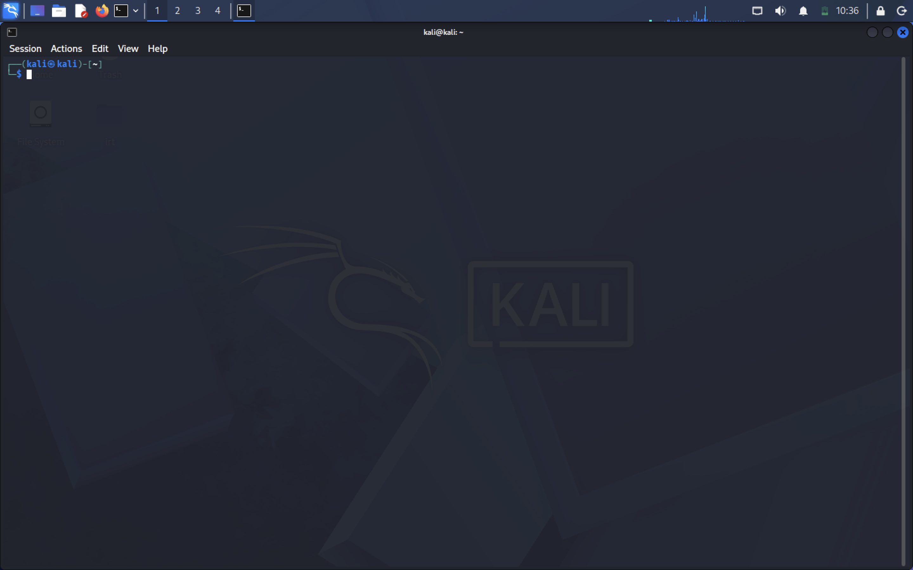
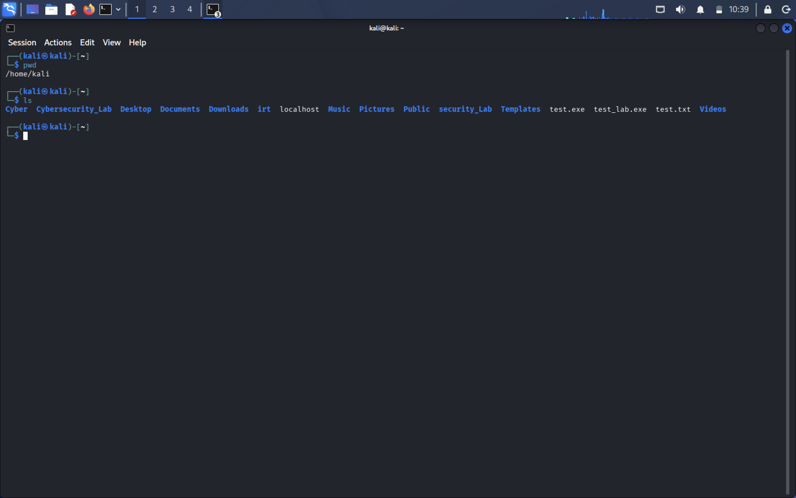
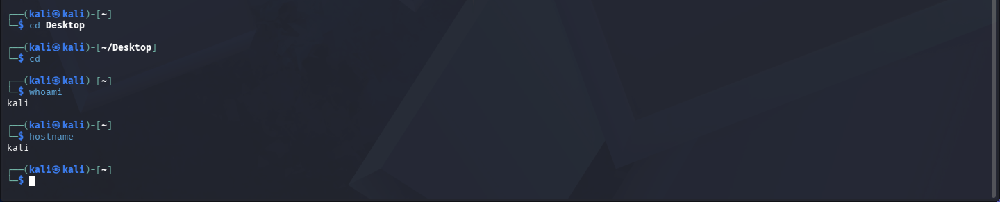
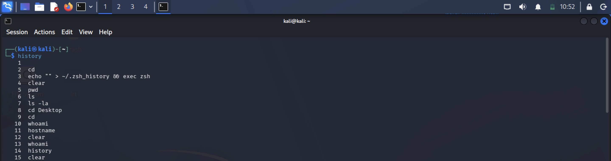
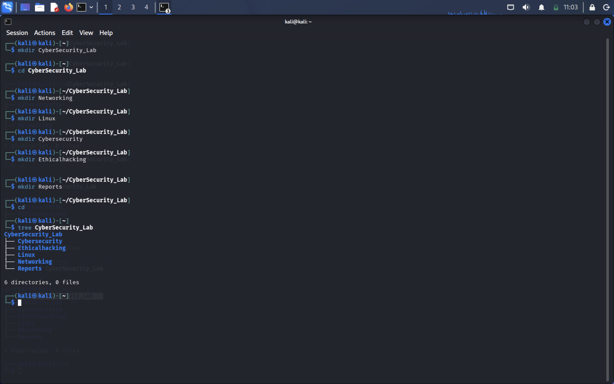
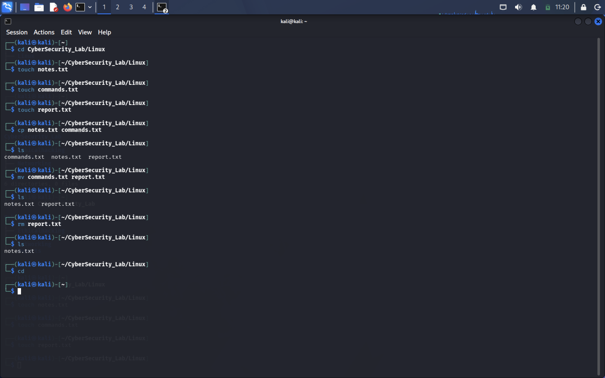

# Linux Task 01 - Linux Environment Setup & Essential Commands

---

# Project Overview

This project was completed as part of the **Linux Fundamentals Lab – Task 01**. The objective of this task is to become familiar with the Linux operating system, understand the command-line interface, and perform basic file and directory management operations.

Linux is one of the most widely used operating systems in cybersecurity, cloud computing, DevOps, networking, and system administration. This task provides hands-on experience with the Linux terminal, navigation commands, and directory management, which are essential skills for every cybersecurity professional.

---

# Objective

The objectives of this task are:

- Install and configure a Linux operating system.
- Understand the Linux desktop environment.
- Learn to use the Linux terminal.
- Practice essential Linux commands.
- Create and manage directories and files.
- Understand the Linux file system hierarchy.
- Gain hands-on experience with command-line operations.

---

# Part A – Environment Setup

A Linux operating system was successfully installed using a Virtual Machine. After installation, the terminal was opened to interact with the operating system using the command-line interface.

## Distribution Used

- Kali Linux

# Tasks Performed

- Installed Kali Linux inside a Virtual Machine.
- Verified successful installation.
- Opened the terminal.
- Confirmed system accessibility.

**Linux Terminal**

---

# Part B – Essential Linux Commands

The following Linux commands were executed to understand terminal navigation and system information.

| Command | Description |
|----------|-------------|
| `pwd` | Displays the current working directory. |
| `ls` | Lists files and directories. |
| `ls -la` | Lists all files including hidden files with detailed information. |
| `cd` | Changes the current directory. |
| `clear` | Clears the terminal screen. |
| `history` | Displays previously executed commands. |
| `whoami` | Displays the current logged-in user. |
| `hostname` | Displays the system hostname. |

# pwd & ls Commands

---

# ls -la Command

---

# cd, whoami & hostname Commands

---

# history & clear Commands

---

# Part C – Directory and File Management

This section demonstrates basic Linux directory management.

# Tasks Performed

- Created directories using `mkdir`
- Navigated between folders using `cd`
- Listed directory contents using `ls`
- Organized files and folders

# Commands Used

| Command | Purpose |
|----------|---------|
| `mkdir` | Create new directories |
| `cd` | Navigate between directories |
| `ls` | Display directory contents |

# Folder Creation

---

# File Structure

---

# Learning Outcomes

After completing this task, I was able to:

- Install and configure Linux.
- Use the Linux terminal efficiently.
- Execute basic Linux commands.
- Navigate through directories.
- Create and organize folders.
- Understand Linux file management.
- Gain confidence using the Linux command-line interface.
- Develop foundational Linux skills required for cybersecurity and system administration.

---

# Technologies Used

- Kali Linux
- VMware
- Kali Terminal

---
