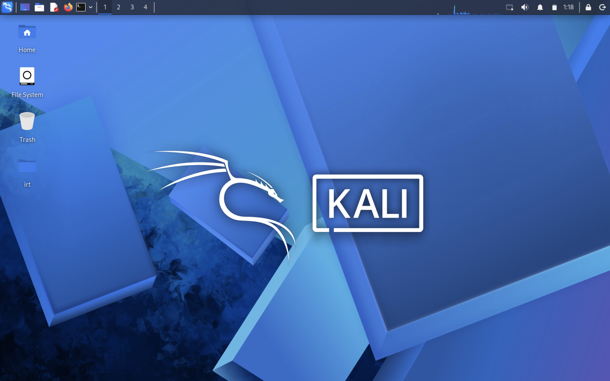
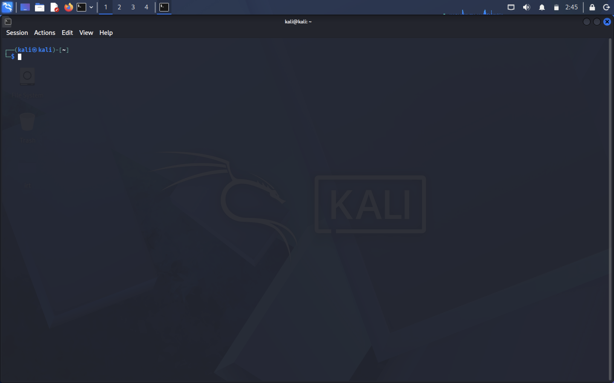
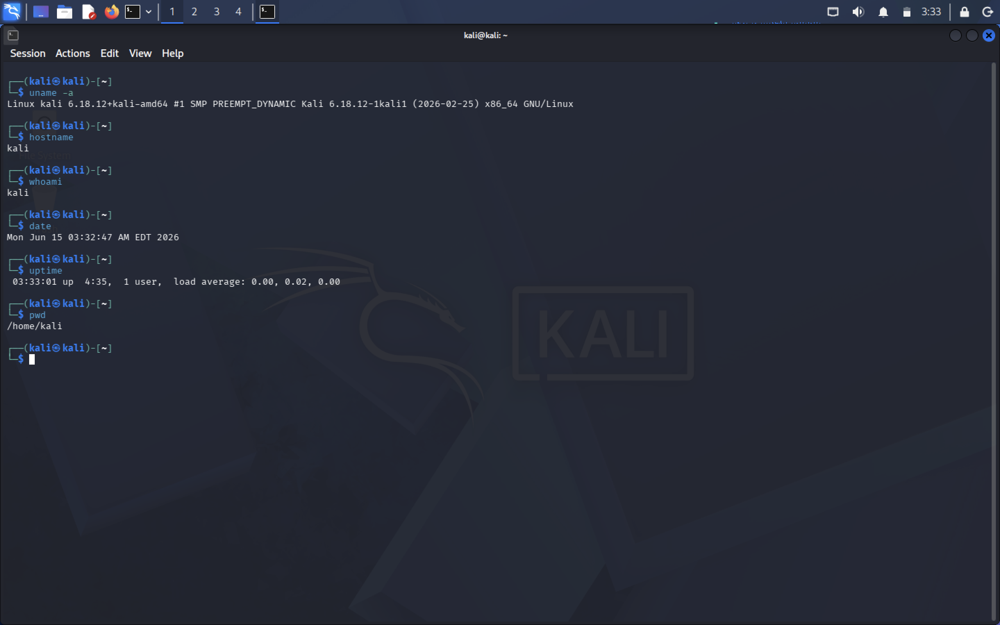
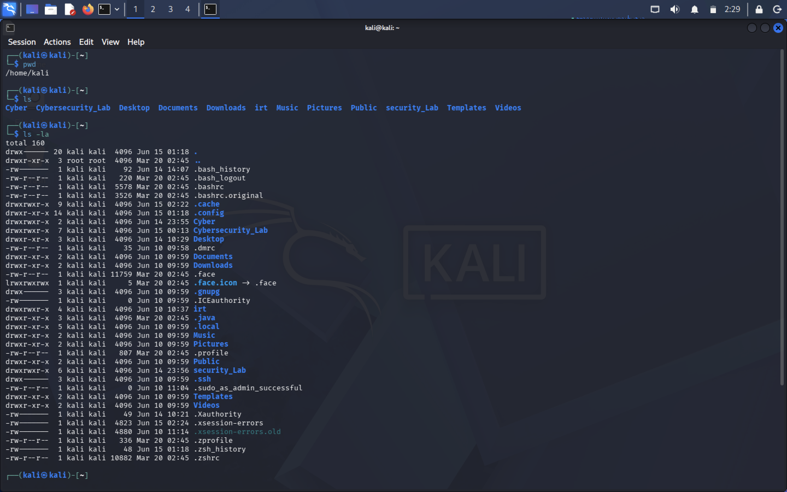
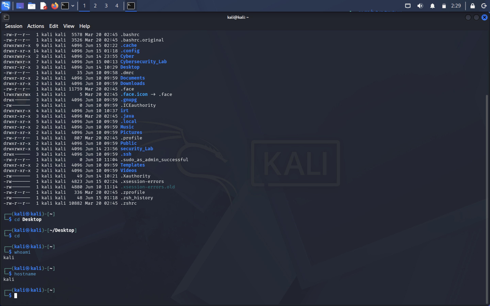
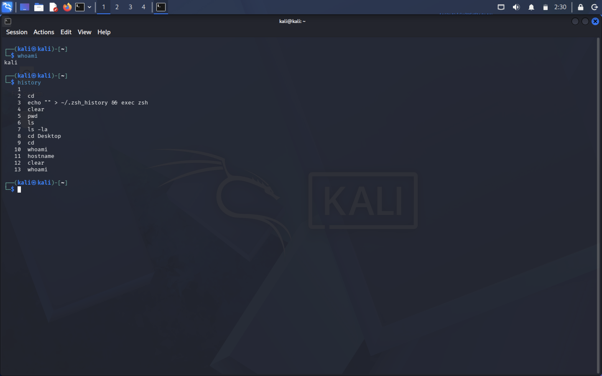
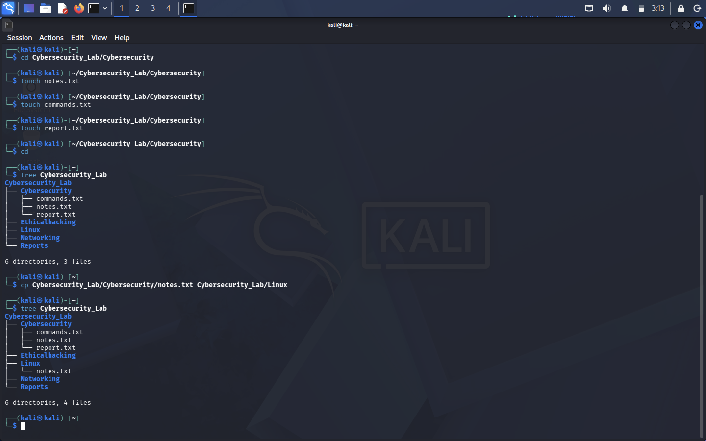

# Linux Task 01: Linux Environment Setup & Essential Commands

## 📌 Project Overview
This repository contains the documentation and practical implementation for **Linux Task 01** of my Cyber Security Internship. The objective of this task is to establish a strong foundational understanding of the Linux operating system, master command-line interface (CLI) navigation, and practice fundamental file and directory management.

---

* **Name:** Khushi Gaikwad
* **Task:** Linux Task 01 - Environment Setup & Essential Commands
Cyber Security 
---

## 🛠️ Part A: Linux Installation & Verification
For this task, a Linux distribution was successfully set up inside a Virtual Machine (VM) environment. 

### Environment Details
* **OS Distribution:** Kali Linux
* **Hypervisor:** VMware Workstation / VirtualBox

### System Verification Screenshots
#### 1. Desktop Environment


#### 2. Terminal Window


#### 3. System Information


---

## 💻 Part B: Basic Navigation Commands
Below is the documentation for the essential navigation commands executed during this task.

| Command | Purpose |
| :--- | :--- |
| `pwd` | **Print Working Directory:** Displays the absolute path of the current directory you are in. |
| `ls` | **List:** Lists the files and directories inside the current working directory. |
| `ls -la` | **List Long & All:** Lists all files (including hidden ones starting with a `.`) with detailed attributes like permissions, size, and owner. |
| `cd` | **Change Directory:** Used to navigate between different folders/directories in the file system. |
| `clear` | **Clear Screen:** Clears all previous commands and outputs from the active terminal screen viewport. |
| `history` | **Command History:** Lists the sequence of commands previously executed in the terminal session. |
| `whoami` | **Who Am I:** Prints the username of the current active user logged into the shell. |
| `hostname` | **Host Name:** Displays the network name assigned to the local host/machine system. |

### Command Execution Screenshots
#### 1. Execution of pwd, ls, and ls -la


#### 2. Execution of cd, clear, and history


#### 3. Execution of whoami and hostname


---

## 📁 Part C: Directory Management
Using the terminal, the following structured hierarchical laboratory environment was successfully created.

### Target Directory Structure
```text
Cybersecurity_Lab/
├── Networking
├── Linux
└── Cybersecurity
    ├── Ethicalhacking
    └── Reports

Verification
Commands Used: mkdir, cd, tree

Structure Screenshot:

## 📂 Part D: File Management
File operations including creation, moving, copying, renaming, and deletion were performed inside the newly created directories.

### Detailed Operations Summary
* **File Creation:** Used `touch notes.txt`, `touch commands.txt`, and `touch report.txt` to populate directories.
* **Copying (cp):** Copied files between directories to establish data redundancy.
* **Moving & Renaming (mv):** Used `mv` to transfer files across directories and to rename files by specifying a new destination.
* **Deletion (rm):** Used `rm` to safely clear temporary or redundant files from the lab directories.

### File Operations Screenshots
#### 1. File Creation & Copying

#### 2. Moving and Renaming Files


#### 3. File Deletion Verification


---

## 📊 Part E: System Information Collection
The following snapshot details the exact system properties gathered from the running virtual machine environment.

* **Kernel Version:** `Linux kali 6.x.x` *(Or your exact output from `uname -a`)*
* **Username:** khushi
* **Current Directory:** `/home/khushi/Cybersecurity_Lab`
* **Current Date and Time:** Mon Jun 15 2026
* **System Uptime:** *[Paste output of uptime command here]*

### System Information Screenshot


---

## 📝 Part F: Linux Research Activity

### 1. What is Linux?
Linux is an open-source, Unix-like operating system kernel first developed by Linus Torvalds in 1991. Unlike proprietary operating systems, its source code is freely available for anyone to modify, distribute, and enhance, making it the foundational backbone for modern servers, cloud infrastructure, and security platforms.

### 2. Key Differences: Linux vs. Windows
* **Open Source vs. Proprietary:** Linux is open-source and free to customize, whereas Windows is a closed-source proprietary system owned by Microsoft.
* **File System Structure:** Linux organizes everything into a unified tree starting from the root directory (`/`), while Windows separates files across different local storage drives (e.g., `C:`, `D:`).
* **CLI-Centric Architecture:** Linux relies heavily on the powerful terminal interface for advanced system control and scripting, making it ideal for automation, while Windows is historically built around a Graphical User Interface (GUI).
* **Security & Permissions:** Linux implements a strict native privilege configuration (root vs. standard user) and is naturally less targeted by mainstream malware, whereas Windows has a vastly different file security model and remains a primary target for broad malicious attacks.
